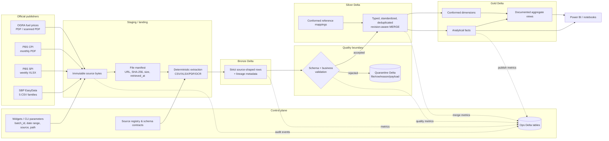
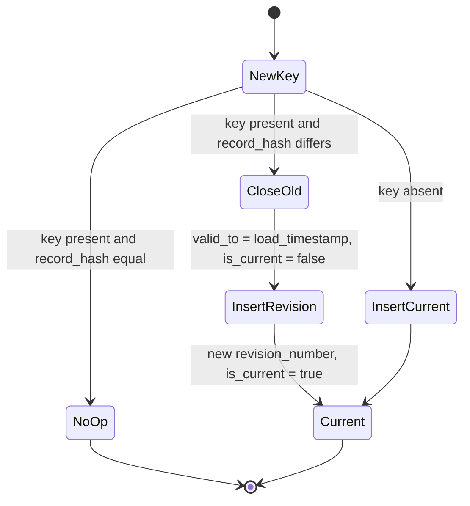

# Lakehouse Architecture

## 1. Architecture goals

The architecture prioritizes reproducibility, traceability, and safe reruns over ingestion speed. Each published number must be traceable to an immutable source file and a pipeline execution. A source-layout change must fail closed into Quarantine; it must not silently alter a Silver or Gold table.

The logical design is portable across Databricks Free Edition and a Unity Catalog-enabled paid workspace. Environment-specific storage and table names are resolved from configuration rather than embedded in transformations.

## 2. End-to-end design



### Processing sequence

1. Validate run parameters and create a `RUNNING` execution-log row.
2. Discover or accept source files, download/copy them to a batch-specific immutable landing path, and compute SHA-256.
3. Register each file in `ops.source_file_manifest`. A byte-identical file is reused, not copied and parsed again.
4. Compare the file/header/sheet/layout signature with the active source contract.
5. Extract rows and read them with an explicit PySpark schema. CSV readers set `inferSchema=False`; XLSX and PDF extraction produce a typed intermediate DataFrame with an explicit schema.
6. Append Bronze rows with complete lineage. Bronze is never updated in place.
7. Apply structural, type, domain, key, and reconciliation rules. Route failures to Quarantine.
8. Standardize valid rows and `MERGE` into Silver using deterministic business keys and record hashes.
9. Rebuild only affected Gold partitions/views.
10. Commit metrics and end state to Ops. A failed run records the exception class/message and remains restartable with the same parameters.

## 3. Layer responsibilities

| Layer | Responsibility | Write pattern | What is prohibited |
|---|---|---|---|
| Staging / landing | Preserve exact downloaded/uploaded bytes; record discovery and retrieval metadata; hold deterministic parser output before Delta ingestion | New batch/hash path only; no overwrite | Editing a source file, using a mutable “latest” file as evidence, or parsing without a manifest |
| Bronze | Persist strict, source-shaped records with raw textual values where necessary and complete lineage | Append-only Delta; partition sparingly by source and ingestion date | Business aggregation, destructive correction, implicit type inference, or dropping rejected source values |
| Silver | Parse and standardize dates, numeric values, units, labels, keys, and status; validate; deduplicate; track revisions | Delta `MERGE` on business key; version change on hash difference | Losing the previous revision, coercing invalid values to zero, or merging on mutable labels alone |
| Gold | Provide conformed facts, dimensions, and approved aggregates for BI | Incremental merge or replace only affected partitions; views where practical | Source-specific parsing, ungoverned calculations, or undocumented many-to-many joins |
| Quarantine | Retain file-level and row-level failures with original payload, rule, reason, and lineage | Append-only; resolution creates a new processing event | Manual deletion to “fix” counts or automatic promotion without passing the active contract |
| Ops | Coordinate runs, manifests, checkpoints, schema versions, row counts, quality results, and errors | Insert start event; atomic terminal update; append detail events | Treating notebook output as the audit log or allowing a success status before reconciliation |

## 4. Storage strategy

### 4.1 Preferred profile: Unity Catalog-enabled Free Edition

Current Databricks guidance deprecates DBFS root and DBFS mounts for new workloads. When the workspace exposes Unity Catalog, use managed Delta tables plus a managed Volume:

```text
Catalog: pakistan_economy
Schemas:
  bronze
  silver
  gold
  quarantine
  ops

Volume:
  /Volumes/pakistan_economy/ops/source_files/
    <source_system>/<dataset_code>/ingest_date=YYYY-MM-DD/
      batch_id=<uuid>/<sha256>/<original_filename>
```

- Store raw CSV/XLSX/PDF bytes in the Volume.
- Use Unity Catalog managed Delta tables for Bronze, Silver, Gold, Quarantine, and Ops.
- Store notebooks and small configuration files as Workspace files or in a Git repository, not in the raw-data Volume.
- Do not create DBFS mounts to the same location and do not expose Unity Catalog managed storage as a general file path.

Example object names:

```text
pakistan_economy.bronze.sbp_remittance
pakistan_economy.silver.sbp_remittance_monthly
pakistan_economy.gold.fact_external_flow_monthly
pakistan_economy.quarantine.rejected_records
pakistan_economy.ops.pipeline_execution_logs
```

### 4.2 Compatibility profile: legacy Community Edition / no Unity Catalog

If the academic workspace only provides the workspace-scoped Hive metastore, use managed Delta tables under `hive_metastore` and a project-specific DBFS root path as a **compatibility fallback only**:

```text
dbfs:/FileStore/pakistan_economy/source_files/...

Databases:
  pe_bronze
  pe_silver
  pe_gold
  pe_quarantine
  pe_ops
```

This fallback acknowledges the limitations of the teaching environment. DBFS root is workspace-wide legacy storage and does not provide Unity Catalog governance. Do not store credentials or confidential data in it. Keep the path resolver isolated so migration is a configuration change:

```python
storage_profile = dbutils.widgets.get("storage_profile")  # "uc" or "legacy_dbfs"
raw_root = (
    "/Volumes/pakistan_economy/ops/source_files"
    if storage_profile == "uc"
    else "dbfs:/FileStore/pakistan_economy/source_files"
)
catalog_prefix = "pakistan_economy" if storage_profile == "uc" else "hive_metastore"
```

### 4.3 Storage rules for the free tier

- Favor compact Delta tables and avoid partitioning small datasets by high-cardinality columns.
- Partition immutable files by source/date/batch in the path, but usually leave small Bronze/Silver tables unpartitioned; use `OPTIMIZE` only if supported and justified by file counts.
- Cache only within a notebook run and unpersist promptly.
- Retain source snapshots needed for the course evidence and revision history; document any quota-driven archival policy.
- Do not rely on always-on clusters, paid workflows, or external cloud credentials. Every notebook must be manually runnable in dependency order.
- Export a small Gold snapshot for Power BI only when the Databricks connector is unavailable; the Delta table remains the system of record.

## 5. Naming and path conventions

| Object | Convention | Example |
|---|---|---|
| Batch ID | UUID supplied or generated once at orchestration start | `7ea7...` |
| Run ID | UUID per notebook/pipeline execution | `16dd...` |
| Dataset code | Uppercase publisher code; governed alias for non-catalogue sources | `TS_GP_BOP_WR_M`, `PBS_SPI_W`, `OGRA_FUEL_ADHOC` |
| Delta table | lowercase snake case, layer namespace | `silver.sbp_fx_daily` |
| Business key hash | SHA-256 of delimiter-safe canonical key values | `sha2(concat_ws('¦', ...), 256)` |
| Record hash | SHA-256 of canonical non-key business attributes | used to detect revisions/unchanged rows |
| Raw path | publisher/dataset/date/batch/hash/file | one immutable object per file hash |
| Date semantics | `*_date` for calendar dates, `*_timestamp` for instants | `period_end_date`, `load_timestamp` |

All timestamps are stored as UTC. Publisher-local effective dates remain `DATE`; Pakistan publication timestamps may also retain `source_timezone = 'Asia/Karachi'` when known.

## 6. Schema enforcement and drift

### 6.1 Contract registry

`ops.schema_contracts` stores one active record per source schema version:

| Field | Purpose |
|---|---|
| `source_system`, `dataset_code`, `schema_version` | Contract identity |
| `expected_format` | `CSV`, `XLSX`, `PDF_TEXT`, or `PDF_OCR` |
| `expected_headers_json` | Ordered/normalized CSV or sheet headers |
| `expected_sheets_json` | Required and optional workbook sheets |
| `spark_schema_json` | Serialized explicit `StructType` |
| `parser_version` | Versioned extraction implementation |
| `effective_from`, `effective_to`, `is_active` | Contract validity |
| `contract_hash` | Detects accidental edits |

### 6.2 Drift policy

- **Additive, known optional field:** accept only after a reviewed contract-version change; preserve old schema version.
- **Renamed, removed, reordered required field:** quarantine the file as `SCHEMA_SIGNATURE_MISMATCH`.
- **Unknown series/currency/sector/commodity:** quarantine as `REFERENCE_VALUE_UNKNOWN`; do not generate a silent key.
- **PDF table moved or OCR confidence below threshold:** quarantine affected rows; retain page number, bounding box/text, and confidence.
- **Type parse failure:** retain raw value and error detail; never convert an invalid amount to zero.
- **Unit/frequency change:** file-level quarantine because it can invalidate every record.

Rescuing arbitrary columns into a permissive map is intentionally not the default: the course requirement is strict schema-on-read. A raw parser payload may be stored for diagnosis, but accepted Bronze fields must match a reviewed `StructType`.

## 7. Lineage strategy

Every Bronze and Silver row physically contains the common lineage columns defined in `data_dictionary.md`, including:

- `batch_id`, `run_id`, `source_system`, `dataset_code`;
- `source_file_name`, `source_file_path`, `source_file_sha256`;
- `source_row_number` or page/sheet coordinates;
- `schema_version`, `parser_version`, and `load_timestamp`;
- `record_hash` in Silver.

Gold facts retain `source_system`, `dataset_code`, `silver_business_key_hash`, and the winning Silver version/run. Many-to-one aggregates use a bridge/audit view that lists contributing Silver keys; a dashboard value can therefore be traced back to all contributing observations.

## 8. Idempotency and Delta `MERGE`

### 8.1 File idempotency

`ops.source_file_manifest` has a uniqueness contract on `(dataset_code, source_file_sha256)`. A repeat download with identical bytes is marked `DUPLICATE_CONTENT` and can skip parsing. The same filename with a different hash is a new source version.

### 8.2 Row idempotency

Each Silver table has:

- a documented natural/business key;
- `business_key_hash` computed from canonical key values;
- `record_hash` computed from non-key business attributes;
- a revision policy.

For mutable official observations, use a current-plus-history pattern:



Delta `MERGE` targets the current record on the natural key. The implementation must deduplicate the source DataFrame to exactly one candidate per key before `MERGE`; multiple candidates are quarantined as `DUPLICATE_BUSINESS_KEY_IN_BATCH` unless a deterministic publisher revision order exists.

For append-only Bronze, use `(source_file_sha256, source_row_number, parser_version)` as the ingestion key when replay protection is needed. Bronze evidence is not updated.

## 9. Revision tracking

An official revision is distinct from a duplicate:

| Condition | Action |
|---|---|
| Same business key, same `record_hash` | No-op; increment run's unchanged count |
| Same business key, changed value/status/comment | Close current version and insert next `revision_number` |
| New file hash but same parsed values | Register file revision; Silver remains unchanged |
| Publisher retracts a value | Insert a new current version with `observation_status='RETRACTED'`; do not delete history |
| Parser improvement changes extraction from unchanged source bytes | New `parser_version`; require reconciliation and approval before it becomes current |

Silver records carry `valid_from_timestamp`, `valid_to_timestamp`, `is_current`, and `revision_number`. Gold defaults to current records but can expose “as published on” views for research reproducibility.

## 10. Operational auditing

### 10.1 `ops.pipeline_execution_logs`

Required columns:

| Column | Spark type | Description |
|---|---|---|
| `run_id` | `STRING` | Primary execution identifier |
| `parent_run_id` | `STRING` | Optional orchestration parent |
| `batch_id` | `STRING` | Logical source batch/backfill identifier |
| `pipeline_name` | `STRING` | Notebook/job name |
| `source_system` | `STRING` | `SBP`, `PBS`, `OGRA`, or `MULTI` |
| `dataset_code` | `STRING` | Dataset being processed |
| `layer` | `STRING` | `STAGING`, `BRONZE`, `SILVER`, or `GOLD` |
| `parameters_json` | `STRING` | Canonical JSON of widget/CLI parameters |
| `started_at`, `ended_at` | `TIMESTAMP` | UTC execution boundaries |
| `status` | `STRING` | `RUNNING`, `SUCCEEDED`, `FAILED`, or `PARTIAL` |
| `rows_read` | `LONG` | Input records considered |
| `rows_accepted` | `LONG` | Records passing the layer contract |
| `rows_inserted` | `LONG` | Accepted source keys not previously present in the target |
| `rows_updated` | `LONG` | Accepted keys whose prior current version was superseded; the close-plus-insert transaction counts as one source-row outcome |
| `rows_unchanged` | `LONG` | Keys already present with same hash |
| `rows_quarantined` | `LONG` | Rejected records |
| `source_file_count` | `INT` | Files considered by the run |
| `error_class`, `error_message` | `STRING` | Truncated diagnostic for failed/partial runs |
| `notebook_path`, `code_version` | `STRING` | Executable lineage (Git commit when available) |

The terminal log update occurs in a `finally` block. Counts must reconcile:

```text
rows_read = rows_accepted + rows_quarantined
rows_accepted = rows_inserted + rows_updated + rows_unchanged
```

`rows_inserted` and `rows_updated` are source-row outcomes, not low-level Delta file actions. A revision may physically close one row and insert another, but it contributes one `rows_updated` event. Optional `target_rows_written` may capture physical write amplification when needed.

Where a layer legitimately expands one source row into multiple observations, both `input_rows_read` and `output_rows_produced` are logged and the source-specific reconciliation rule is recorded.

### 10.2 Supporting Ops tables

- `source_file_manifest`: resolved URL, content type, size, hashes, publication/effective date, retrieval state.
- `schema_contracts`: versioned structural contracts.
- `data_quality_results`: run, rule, severity, tested count, failed count, threshold, sample keys.
- `pipeline_checkpoints`: last successful watermark per dataset and storage profile.
- `reference_mappings`: governed aliases for country, currency, sector, commodity, CPI/SPI group, and fuel product.

## 11. Quarantine model

`quarantine.rejected_records` supports both file- and row-level failures:

```text
quarantine_id STRING NOT NULL
run_id STRING NOT NULL
batch_id STRING NOT NULL
source_system STRING NOT NULL
dataset_code STRING NOT NULL
source_file_path STRING NOT NULL
source_file_sha256 STRING NOT NULL
source_location STRING            -- row, sheet/cell, or PDF page/bounding box
failure_scope STRING NOT NULL      -- FILE or ROW
rule_code STRING NOT NULL
rule_severity STRING NOT NULL      -- ERROR or WARNING
reason STRING NOT NULL
raw_payload STRING
schema_version STRING
parser_version STRING
quarantined_at TIMESTAMP NOT NULL
resolution_status STRING NOT NULL  -- OPEN, WAIVED, REPROCESSED, RESOLVED
resolution_run_id STRING
```

Warnings may accompany accepted records; errors prevent Silver publication. Reprocessing creates a new run and links it through `resolution_run_id` rather than modifying the original rejection.

## 12. Backfill contract

All layer notebooks accept the same core parameters:

| Parameter | Required | Behavior |
|---|---:|---|
| `batch_id` | Yes | Stable logical batch; generated once only when omitted in interactive development |
| `source_system` / `dataset_code` | Yes | Limits processing to an approved source contract |
| `from_date`, `to_date` | Conditional | Inclusive observation/effective-date range |
| `input_path` | Conditional | Explicit folder/file for controlled replay |
| `storage_profile` | Yes | `uc` or `legacy_dbfs` |
| `schema_version` | No | Defaults to active version; pinned for reproducible replay |
| `dry_run` | No | Validates/displays metrics without target merge |
| `force_reparse` | No | Re-extracts known file hash with a new parser version; never bypasses validation |

Exactly one selection mode is allowed: date range or explicit input path. The parameter JSON is canonicalized and written to the run log.

## 13. Security and reliability boundaries

- Only public official statistics are in scope; secrets must not be embedded in notebooks or DBFS.
- Remote URLs are allow-listed to official SBP, PBS, and OGRA hosts and redirects are recorded.
- File size, content type, extension, and checksum are validated before parsing.
- PDF/OCR output is treated as untrusted extracted data and must pass type/range/reconciliation checks.
- Pipeline code never executes text extracted from a source document.
- A failed Silver or Gold transaction must leave the previous Delta version queryable.
- Power BI receives read-only access to Gold objects, not Bronze, Quarantine, or raw files.

## 14. Design references

- [Databricks: Best practices for DBFS and Unity Catalog](https://docs.databricks.com/aws/en/dbfs/unity-catalog)
- [Databricks: DBFS root locations and recommended alternatives](https://docs.databricks.com/aws/en/dbfs/root-locations)
- [SBP EasyData](https://easydata.sbp.org.pk/)
- [PBS Price Statistics](https://www.pbs.gov.pk/price-statistics/)
- [OGRA Fuel Pricing portal](https://price.ogra.org.pk/?ui=en)

The storage profile must be validated against the actual teaching workspace before implementation; product capabilities and free-tier quotas can change.
