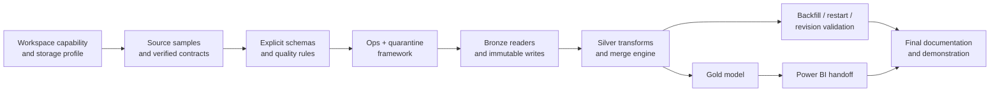

# Phase 2 Implementation Plan

## 1. Delivery objective

Phase 2 will deliver a runnable, documented PySpark/Delta pipeline for all eight source families on Databricks Free Edition. The implementation must demonstrate strict schemas, immutable source evidence, record-level lineage, idempotent Delta `MERGE`, schema-drift quarantine, parameterized backfills, and reconciled operational logs.

The plan is organized as dependency-ordered work packages. A milestone is complete only when its exit criteria and evidence are available; notebook execution without reconciled outputs is not completion.

## 2. Definition of done

A work item is done when:

- code and configuration are version controlled;
- public functions/notebooks have documented inputs and outputs;
- explicit Spark schemas are used and `inferSchema=True` is absent;
- positive, negative, and rerun tests pass;
- audit counts reconcile and failures appear in Quarantine;
- the implementation works with the selected storage profile;
- evidence (sample run ID, table query, or screenshot) is linked in the milestone record;
- related documentation and data dictionary entries are updated.

## 3. Work breakdown structure (WBS)

### 1.0 Environment and project foundation

| WBS | Work package | Deliverables | Acceptance criteria | Depends on |
|---|---|---|---|---|
| 1.1 | Workspace capability assessment | Record of runtime version, Delta availability, Unity Catalog/Volume support, Python libraries, storage quota, and Power BI connection option | A probe notebook runs successfully and selects `uc` or `legacy_dbfs` without hard-coded paths | — |
| 1.2 | Repository/notebook structure | `/src`, `/notebooks`, `/config`, `/tests`, `/docs` conventions; notebook naming and dependency order | A new contributor can identify entry points and shared modules from the README | 1.1 |
| 1.3 | Storage namespaces | Bronze, Silver, Gold, Quarantine, and Ops schemas/databases; raw-file root | Idempotent bootstrap creates all objects twice without error | 1.1 |
| 1.4 | Dependency strategy | Pinned/lightweight libraries for XLSX, PDF text extraction, and optional OCR; installation instructions | Fresh compute can import dependencies; unsupported native OCR has a documented local/preprocessing fallback | 1.1 |
| 1.5 | Configuration model | Environment config, source registry, path resolver, dataset aliases, and official-host allow-list | No transformation notebook embeds an environment-specific root path or secret | 1.2, 1.3 |

### 2.0 Schema and source-contract definition

| WBS | Work package | Deliverables | Acceptance criteria | Depends on |
|---|---|---|---|---|
| 2.1 | Source sampling | At least two releases per source where available, including a historical/revised or structurally different example | Samples and SHA-256 hashes are registered; licensing/public-source note retained | 1.3, 1.5 |
| 2.2 | SBP contract verification | Confirm current catalogue code, title, frequency, unit, long/wide CSV layout, missing-value tokens, and series metadata for five datasets | Any discrepancy with configured identifiers is resolved by a versioned alias/config change, not code branching | 2.1 |
| 2.3 | PBS SPI workbook profiling | Sheet inventory, header rows, merged-cell handling, record types, date locations, and formula/cached-value behavior | Parser reads two releases and produces identical canonical columns | 2.1 |
| 2.4 | PBS CPI PDF profiling | Table/page map, national/urban/rural groups, base-year text, provisional markers, and extraction mode | Text-based samples reconcile to printed headline values; layout signature documented | 2.1 |
| 2.5 | OGRA PDF/OCR profiling | Notification/effective date patterns, product aliases, price/component tables, scan detection, and confidence threshold | Born-digital and scanned samples either parse successfully or fail with an expected quarantine code | 2.1 |
| 2.6 | Explicit PySpark schemas | `StructType`/`StructField` objects for every Bronze/Silver contract and Ops/Quarantine tables | Unit test asserts expected field name, type, and nullability; no inference enabled | 2.2–2.5 |
| 2.7 | Data-quality rule catalogue | Rule ID, layer, severity, expression, threshold, and remediation owner | All non-null keys, date/frequency, numeric/range, unit, and reconciliation rules have stable IDs | 2.6 |

### 3.0 Operational logging and control framework

| WBS | Work package | Deliverables | Acceptance criteria | Depends on |
|---|---|---|---|---|
| 3.1 | Parameter utility | Widgets/CLI adapter for `batch_id`, source, date/path selection, schema version, storage profile, and dry run | Invalid/mutually exclusive parameters fail before source writes and are logged | 1.5 |
| 3.2 | Run logger | Start/success/failure functions for `pipeline_execution_logs` | Deliberate exception produces one terminal `FAILED` row with timestamps and parameters | 1.3, 3.1 |
| 3.3 | File manifest | `source_file_manifest` table and hashing/register functions | Same dataset/hash is recognized as duplicate; same filename/different hash is a new version | 1.3 |
| 3.4 | Quality result logger | Rule-level counts and samples in `data_quality_results` | Batch quality summary reconciles to accepted/quarantined rows | 2.7, 3.2 |
| 3.5 | Quarantine writer | File/row failure API with payload and location | A schema mismatch and a bad numeric row are queryable with distinct reason codes | 3.2, 3.3 |
| 3.6 | Checkpoint/watermark utility | Last-success watermark by dataset and layer | Failed runs do not advance checkpoint; successful replay does not skip incomplete work | 3.2 |

### 4.0 Bronze ingestion engine

| WBS | Work package | Deliverables | Acceptance criteria | Depends on |
|---|---|---|---|---|
| 4.1 | Discovery/acquisition adapters | SBP/PBS/OGRA URL discovery or controlled upload interface, allow-list, retry policy | Exact resolved URL, retrieval time, content type, bytes, and hash are recorded | 3.3 |
| 4.2 | Immutable landing writer | Content-addressed source paths and duplicate-content handling | No existing file is overwritten; identical bytes are not redundantly parsed by default | 4.1 |
| 4.3 | Generic CSV reader | Encoding/delimiter/header validation and explicit schema | All five SBP samples load with `inferSchema=False`; malformed rows are quarantined | 2.6, 3.5, 4.2 |
| 4.4 | XLSX extraction adapter | Deterministic sheet/range reader producing SPI canonical raw rows | Sheet/header drift triggers file quarantine; cell locations are preserved | 2.3, 2.6, 3.5, 4.2 |
| 4.5 | PDF text adapter | Page/table extraction for CPI and born-digital OGRA files | Page and table/line location retained; known headline totals reconcile | 2.4, 2.5, 3.5, 4.2 |
| 4.6 | OCR adapter | Scan detection, page rendering/OCR integration, confidence capture | Low-confidence required fields are quarantined; source image/page remains traceable | 2.5, 3.5, 4.2 |
| 4.7 | Bronze writers | One append-only Delta contract per source family, with all common metadata | Rerunning parser does not mutate prior Bronze evidence; counts match manifest/extractor output | 4.3–4.6 |

### 5.0 Silver standardization and `MERGE`

| WBS | Work package | Deliverables | Acceptance criteria | Depends on |
|---|---|---|---|---|
| 5.1 | Shared standardizers | Date/period parsing, decimal parsing, missing-token handling, whitespace/Unicode normalization, hash utilities | Unit tests cover commas, parentheses, dashes, `P` markers, null tokens, and month/week semantics | 2.6 |
| 5.2 | Reference dimensions/mappings | Country/corridor, currency, ISIC sector, commodity/group, CPI/SPI group, and fuel-product aliases | Unknown values fail closed to Quarantine; mappings are effective-dated/versioned | 2.7, 3.5 |
| 5.3 | SBP remittance transform | `silver.sbp_remittance_monthly` | Key uniqueness, valid units, hierarchy flags, and total-series controls pass | 4.7, 5.1, 5.2 |
| 5.4 | SBP FDI transform | `silver.sbp_fdi_sector_monthly` | `net ≈ inflow − outflow` where all components exist; tolerance documented | 4.7, 5.1, 5.2 |
| 5.5 | SBP FX transform | `silver.sbp_fx_daily` | Unique currency/date key, positive rates, and supported currency-unit mapping | 4.7, 5.1, 5.2 |
| 5.6 | SBP exports/imports transforms | `silver.sbp_export_receipts_monthly`, `silver.sbp_import_payments_monthly` | Commodity hierarchy preserved; totals not double-counted; units validated | 4.7, 5.1, 5.2 |
| 5.7 | PBS SPI transform | `silver.pbs_spi_weekly` | Week-ending date, record type, base year, group/item, and percentage checks pass | 4.7, 5.1, 5.2 |
| 5.8 | PBS CPI transform | `silver.pbs_cpi_monthly` | Domain/group uniqueness, weights/rates/ranges, and headline reconciliation pass | 4.7, 5.1, 5.2 |
| 5.9 | OGRA fuel transform | `silver.ogra_fuel_price` | Notification/effective date, product, units, OCR confidence, and duplicated revision checks pass | 4.7, 5.1, 5.2 |
| 5.10 | Reusable merge engine | Deduplicate-before-merge, current/history handling, and Delta operation metrics | First run inserts; identical rerun is no-op; changed value creates exactly one revision | 5.3–5.9 |

### 6.0 Gold analytical model and Power BI handoff

| WBS | Work package | Deliverables | Acceptance criteria | Depends on |
|---|---|---|---|---|
| 6.1 | Conformed dimensions | Date, series, country, currency, sector, commodity, price group, product | Surrogate/business keys stable; unknown members deliberate, not automatic |
| 6.2 | External-flow fact | Monthly remittance, FDI, export, and import measures at documented grain | Measures retain unit/source/status/hierarchy and join dimensions without orphan keys | 5.3, 5.4, 5.6, 6.1 |
| 6.3 | FX fact | Daily rate fact | Currency/date uniqueness and current-version filter proven | 5.5, 6.1 |
| 6.4 | Price-index fact | Weekly SPI and monthly CPI observations | Frequency/index-family explicitly distinguish non-comparable grains | 5.7, 5.8, 6.1 |
| 6.5 | Fuel-price fact | Effective-date product prices/components | Current and as-published queries return expected revision | 5.9, 6.1 |
| 6.6 | BI semantic contract | Relationships, additive behavior, measure definitions, refresh/export procedure | Power BI sample model loads without many-to-many ambiguity or implicit unit mixing | 6.2–6.5 |

### 7.0 Backfill, resilience, and validation

| WBS | Work package | Deliverables | Acceptance criteria | Depends on |
|---|---|---|---|---|
| 7.1 | Incremental-run test | Latest release for every source | All runs succeed or produce documented source-specific quarantine; logs reconcile | 5.10 |
| 7.2 | Folder/path backfill test | Controlled replay from an explicit source folder | Only selected files/periods process; parameter JSON captures selection | 5.10 |
| 7.3 | Date-range backfill test | Multi-period replay for one SBP and one PBS source | Range is inclusive and deterministic; second execution inserts no duplicate current rows | 5.10 |
| 7.4 | Revision test | Synthetic/known revised source value | Prior version remains queryable; current Gold shows new value | 5.10, 6.2–6.5 |
| 7.5 | Drift and corrupt-file test | Added/renamed column, missing sheet, bad PDF, low OCR confidence | Each fails with expected reason code; no affected record reaches Silver | 4.7, 5.10 |
| 7.6 | Failure/restart test | Inject failure between Bronze and Silver | Restart with same batch is safe; checkpoint and run states remain correct | 3.6, 5.10 |
| 7.7 | Reconciliation suite | Source-to-Bronze-to-Silver-to-Gold row and value checks | Counts and selected publisher totals reconcile within documented tolerance | 6.2–6.5 |

### 8.0 Documentation and handoff

| WBS | Work package | Deliverables | Acceptance criteria | Depends on |
|---|---|---|---|---|
| 8.1 | Architecture and source docs | `overview.md`, `architecture.md` | Match deployed names/paths and cite official sources | 1–7 |
| 8.2 | Data dictionary | `data_dictionary.md` | Every physical Bronze/Silver column has type, nullability, key role, and description | 2.6, 5.3–5.9 |
| 8.3 | Runbook | Bootstrap, normal run, backfill, failure recovery, quarantine reprocess, and Power BI refresh | Another student can execute with no undocumented manual edit | 7.1–7.7 |
| 8.4 | Demonstration package | Sample parameters, run IDs, quality queries, and dashboard/screenshots | Demonstrates idempotency, revision, quarantine, and audit reconciliation | 7.1–7.7 |
| 8.5 | Final quality review | Requirements traceability matrix and known limitations | Every Phase 2 constraint maps to implementation and evidence | 8.1–8.4 |

## 4. Milestones

The sequence below is expressed in relative teaching weeks so it can fit the course calendar without assuming a particular start date.

| Milestone | Target | Included WBS | Exit evidence |
|---|---:|---|---|
| M1 — Environment setup | End of Week 1 | 1.1–1.5 | Capability report, idempotent bootstrap, selected storage profile |
| M2 — Schema definition | End of Week 2 | 2.1–2.7 | Versioned source registry, explicit Spark schemas, quality-rule catalogue |
| M3 — Ops/logging framework | Mid Week 3 | 3.1–3.6 | Successful and failed sample runs, manifest dedupe, quarantine query, checkpoint test |
| M4 — Bronze ingestion engine | End of Week 4 | 4.1–4.7 | All eight families represented in Bronze with lineage; drift/corrupt samples quarantined |
| M5 — Silver standardization & `MERGE` | End of Week 6 | 5.1–5.10 | Eight Silver contracts, first-run/rerun/revision metrics, data-quality report |
| M6 — Gold and Power BI contract | Mid Week 7 | 6.1–6.6 | Facts/dimensions populated and a refreshable sample semantic model |
| M7 — Parameterized backfill validation | End of Week 7 | 7.1–7.7 | Date- and path-based backfill evidence; zero duplicates on rerun; recovery test |
| M8 — Documentation delivery | End of Week 8 | 8.1–8.5 | Reviewed docs, runbook, traceability matrix, demo package, known-limitations register |

## 5. Critical path

PDF/OCR profiling is the highest uncertainty and should start during schema definition rather than waiting for the CSV pipeline to finish.

## 6. Test strategy

### 6.1 Unit tests

- schema field names, Spark types, and nullability;
- date parsing for daily, week-ending, monthly, and ad-hoc effective dates;
- numeric parsing for comma separators, parenthesized negatives, dash/blank nulls, and provisional markers;
- canonical hashes independent of input whitespace or column order;
- alias/reference mapping and unknown-value behavior;
- PDF/OCR regex and table-row parsers using small sanitized fixtures.

### 6.2 Integration tests

- source file → manifest → Bronze for each format;
- Bronze → quality rules → Silver merge;
- Silver current/history → Gold current view;
- Quarantine → corrected contract/parser → reprocess linkage;
- failure after run start → terminal log update and unchanged checkpoint.

### 6.3 Required scenario matrix

| Scenario | Expected result |
|---|---|
| First valid load | New Bronze evidence and Silver inserts |
| Exact batch rerun | No duplicate current Silver or Gold rows; unchanged count increases |
| Same file name, changed bytes | New manifest version; parsed and compared |
| Same key, changed official value | Old version closed; one new current revision |
| Unknown column/sheet/series | Quarantine; no Silver write for affected scope |
| Invalid numeric or impossible date | Row quarantine with raw value/location |
| Null source observation with published missing status | Accepted as null only if status permits it |
| Duplicate key inside one source batch | Quarantine unless publisher revision order is explicit |
| Low OCR confidence on a required field | Quarantine, never guessed |
| Partial run failure | `FAILED` log, no advanced checkpoint, safe replay |

## 7. Data-quality gates

| Gate | Minimum rule |
|---|---|
| Landing → Bronze | Allowed host/path, supported content type, non-zero bytes, hash registered, signature matches contract |
| Bronze → Silver | Required keys present; date and numeric parsing successful; known unit/frequency/reference values; one candidate per key |
| Silver → Gold | Current-key uniqueness; dimension referential integrity; approved status; source-specific reconciliation passes |
| Release readiness | Audit counts reconcile; idempotency/revision/backfill tests pass; docs match physical implementation |

Warnings are permitted only when the rule catalogue marks them non-blocking and the warning is retained. Error-severity failures never pass the layer boundary.

## 8. Roles and suggested ownership

For a small academic team, one person may hold multiple roles, but the review separation remains useful.

| Role | Accountabilities |
|---|---|
| Data engineer | Storage/bootstrap, readers, Delta tables, merge engine, performance |
| Source specialist | Source discovery, sample profiling, mappings, publisher reconciliation |
| Data-quality owner | Rule catalogue, quarantine triage, test fixtures, metric reconciliation |
| BI/data modeller | Gold grain, dimensions, additive behavior, Power BI model |
| Reviewer/documentation owner | Requirements traceability, reproducible runbook, evidence package |

Schema-contract changes and mapping waivers require review by someone other than the author where team size permits.

## 9. Risks and mitigations

| Risk | Likelihood / impact | Mitigation |
|---|---|---|
| SBP identifier/export shape differs from project assumptions | High / High | Catalogue preflight, source aliases in config, contract-version gate |
| PBS workbook sheet/header drift | High / Medium | Header/sheet signatures, cell-coordinate lineage, multi-release fixtures |
| CPI/OGRA PDF extraction changes | High / High | Layout signatures, page-level evidence, fallback parser, quarantine by default |
| OCR unavailable or too heavy in free compute | Medium / High | Perform deterministic OCR before upload or on limited pages; store OCR output/confidence and original scan |
| Free-tier compute/session limits | High / Medium | Small incremental notebooks, persisted checkpoints, compact samples, avoid always-on orchestration assumptions |
| DBFS/Unity Catalog capability mismatch | Medium / High | Storage-profile abstraction and bootstrap probe |
| Hierarchical series double counting | High / High | Hierarchy level/parent/is_total fields; curated additive Gold views only |
| Official revisions overwrite prior values | Medium / High | Immutable hashes and Silver current/history versioning |
| Power BI connectivity unavailable | Medium / Medium | Document connector first; provide governed Gold extract fallback |
| Row-count inflation from wide-to-long extraction | Medium / Medium | Log input and output counts plus source-specific expansion reconciliation |

## 10. Requirements traceability

| Phase 2 requirement | Planned implementation | Verification |
|---|---|---|
| Strict schema-on-read | WBS 2.6, 4.3–4.6 | Schema unit test and source scan for `inferSchema=True` |
| `load_timestamp` and lineage on every record | WBS 4.7, common dictionary columns | Null-count assertion on all Bronze/Silver lineage fields |
| Idempotency via Delta `MERGE` | WBS 5.10 | First-run/rerun/revision integration test |
| Parameterized backfills | WBS 3.1, 7.2, 7.3 | Date-range and folder replay evidence |
| Schema drift and quarantine | WBS 2.7, 3.5, 7.5 | Header/sheet/layout and invalid-value negative tests |
| Operational audit logging | WBS 3.2–3.4 | Run reconciliation queries for success and failure |
| Eight source families | WBS 4.3–4.7, 5.3–5.9 | One successful representative batch per family |
| Power BI-ready analytical layer | WBS 6.1–6.6 | Model relationship check and sample refresh |

## 11. Phase 2 deliverables checklist

- [ ] Capability assessment and selected storage profile
- [ ] Idempotent schema/database bootstrap
- [ ] Source registry and verified dataset aliases
- [ ] Explicit PySpark schemas for all persisted tables
- [ ] Source file manifest and immutable snapshots
- [ ] Ops logger, quality logger, checkpoints, and Quarantine
- [ ] CSV, XLSX, PDF-text, and OCR ingestion paths
- [ ] Bronze tables for all eight sources
- [ ] Silver standardizers and Delta merge/version logic
- [ ] Gold facts/dimensions and Power BI semantic notes
- [ ] Incremental, rerun, revision, drift, failure, and backfill evidence
- [ ] Overview, architecture, plan, data dictionary, and operational runbook
- [ ] Final requirements traceability and known-limitations register
